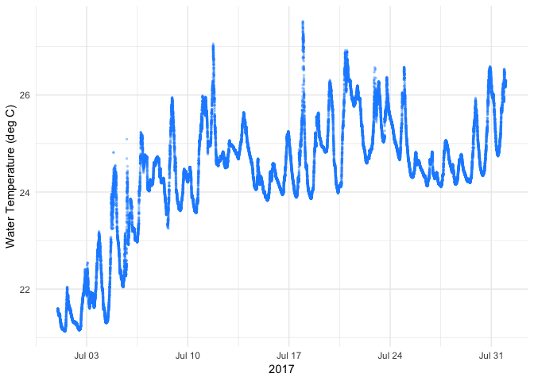

Bad Buoy, Bad Buoy, whatchya gonna do?
================
Taylor Leach
2/11/2019

Bad Buoy, Bad Buoy
==================

Environmental data is often collected using autonomous sensors on buoy or stream monitoring stations. These stations collect many different important parameters such as air temperature and relative humidity as well as aquatic variables like water temperature, dissolved oxygen and chlorophyll fluorescence (a measure of how much algae is in the water). These data are measured at time intervals from secs to hours depending on site, creating many thousands of data points a day and millions over the years. However, these buoy platforms and the sensors on them can sometimes act up, giving inaccurate measurements or breakdown and stop measuring altogether. A common challenge in using these high-frequency data is identifying sensor failure early and fix or remove bad data for later data analysis. Currently, bad data identification in this field is a primarily manual process, with only a simple automated processes (‘out of range’ threshold is the most common).

### Objective

I wanted to come up with a better method for identifying and flagging bad data. To do this, I built a model to predict bad/flagged in automated environmental monitoring stations.

### Data

The data I am using here come from an automated buoy - names 'David Buoy' run by the Center for Limnology at the University of Wisconsin, Madison. <http://blog.limnology.wisc.edu/david-buoy-ready-for-year-6-on-lake-mendota/>

These data include about 4 growing seasons of air temperature, and relative humidity, water temperature, dissolved oxygen (mg/l and percent saturation), and chlorophyll and phycocyanin fluorescence which are measures of how much algea and cyanobacteria are in the water, respectively. I did a bunch of data cleaning that I am not including here.

``` r
setwd("~/Dropbox/0_Sensor_flagged_data")
load(file = 'dat.Rdata', verbose = TRUE)
```

    ## Loading objects:
    ##   alldat

``` r
range(alldat$datetime)
```

    ## [1] "2014-05-05 00:00:00 GMT" "2017-11-13 16:06:00 GMT"

``` r
knitr::opts_chunk$set(echo = TRUE)
library(plyr)
library(dplyr)
library(xgboost)
library(caret)
library(ggplot2)
```

Here is an example time series of the water temperature from July 2017.



``` r
str(alldat) # at the very beginning of the data set the Temp/DO sensor was broken, so there are some NA's initially. Don't worry there are a lot more interesting data in here. 
```

    ## 'data.frame':    7766906 obs. of  11 variables:
    ##  $ datetime             : POSIXct, format: "2014-05-05 00:00:00" "2014-05-05 00:01:00" ...
    ##  $ variable             : chr  "doptotemp" "doptotemp" "doptotemp" "doptotemp" ...
    ##  $ value                : num  NA NA NA NA NA NA NA NA NA NA ...
    ##  $ zscore               : num  NA NA NA NA NA NA NA NA NA NA ...
    ##  $ timefromlast         : num  NA 1 1 1 1 1 1 1 1 1 ...
    ##  $ first_diff           : num  NA NA NA NA NA NA NA NA NA NA ...
    ##  $ second_diff          : num  NA NA NA NA NA NA NA NA NA NA ...
    ##  $ previous.value       : num  NA NA NA NA NA NA NA NA NA NA ...
    ##  $ is.previous.identical: num  NA NA NA NA NA NA NA NA NA NA ...
    ##  $ flag                 : chr  "C" "C" "C" "C" ...
    ##  $ flagYN               : num  1 1 1 1 1 1 1 1 1 1 ...

I normalized all of the measured values as z-scores --&gt; (x - mu)/sd and then build several features that I thought might help predict whether or not you had bad data. Since this is time series data, I decided to only build features that rely on previous values since often times we can access real-time streaming data from these buoy platforms.

These included: *zscore == (x - mu)/sd (all the below features were calculated with the zscore, not the value because the values vary pretty widely between sensors.) *timefromlast == time since the last measurement *first\_diff == the first difference of the zscore *second\_diff == the second difference of the zscore, I like to think about this as acceleration (+ or -) in the measurements. *previous.value == this is the zscore of the previous measurement. *is.previous.identical == a logical feature for whether or not the observation is identical to the previous observation.

Balancing the data
==================

There are a lot more 'good' values than bad/flagged ones (like 97% good data). So I decided to balance the data between the good and bad for the model.

``` r
load(file = 'dat.Rdata', verbose = TRUE)
```

    ## Loading objects:
    ##   alldat

``` r
alldat = alldat[!is.na(alldat$zscore), ] # if there is no zscore we can't do much here so get rid of them
edflags = subset(alldat, flag %in%c("E", "D")) # the flags that aren't NA's or out of range (i.e. the basecase already applied)
goodonly = subset(alldat, flag =="")
alldat.small = dplyr::sample_n(goodonly, nrow(edflags)) # randomly sample so our dataset is 50:50 good and bab
alldata.balanced = rbind(edflags, alldat.small)
```

Base case
=========

The base case that I used here was a simple threshold - so do observed values fall outside a range of expected values for a given parameter? For example, water temperature is fresh water never below 0 deg C and won't get above 40 deg C at the latitude where this lake is located. I didn't know the actual ranges that the data owners used but I was able to reconstruct them from the good data and a some experience working with these types of sensors.

``` r
detach(package:plyr)
load(file = 'dat.Rdata', verbose = TRUE)
```

    ## Loading objects:
    ##   alldat

``` r
inrange = subset(alldat, flag == "")
gg = inrange %>%
  group_by(variable) %>%
  summarize(low = min(value, na.rm = T), high = max(value, na.rm = T))
gg
```

    ## # A tibble: 7 x 3
    ##   variable       low    high
    ##   <chr>        <dbl>   <dbl>
    ## 1 airTL        -9.67    39.4
    ## 2 chlor.x   -2784.   49278. 
    ## 3 doptoppm      0       23.6
    ## 4 doptosat      0      205. 
    ## 5 doptotemp     3.39    29  
    ## 6 phyco     -9350.   49272. 
    ## 7 rhL           0      102.

I rounded a bit and then applied these thresholds to all of the data. This had to be done pretty manually because the thresholds were unique for each variable.

``` r
wtemp = subset(alldata.balanced , variable == "doptotemp")
wtemp$flagBASE = c(rep(0, length(wtemp$value)))
wtemp$flagBASE = as.numeric(is.na(wtemp$value) | (wtemp$value > 40 | wtemp$value < 0))

airtemp = subset(alldata.balanced , variable =="airTL")
airtemp$flagBASE = c(rep(0, length(airtemp$value)))
airtemp$flagBASE = as.numeric(is.na(airtemp$value) | (airtemp$value > 40 | airtemp$value < -10))

doobs = subset(alldata.balanced , variable =="doptoppm")
doobs$flagBASE = c(rep(0, length(doobs$value)))
doobs$flagBASE = as.numeric(is.na(doobs$value) | (doobs$value > 24 | doobs$value < 0))

doobspercent = subset(alldata.balanced , variable == "doptosat")
doobspercent$flagBASE = c(rep(0, length(doobspercent$value)))
doobspercent$flagBASE = as.numeric(is.na(doobspercent$value) | (doobspercent$value > 205 | doobspercent$value < 0))

phytos = subset(alldata.balanced , variable %in% c("chlor.x", "phyco"))
phytos$flagBASE = c(rep(0, length(phytos$value)))
phytos$flagBASE = as.numeric(is.na(phytos$value) | (phytos$value > 50000 | phytos$value < -3000))

relH = subset(alldata.balanced , variable =="rhL")
relH$flagBASE = c(rep(0, length(relH$value)))
relH$flagBASE = as.numeric((is.na(relH$value) | (relH$value <= 0 | relH$value > 102)))

alldat.balanced.base = rbind(wtemp, airtemp,doobs,doobspercent, phytos,relH)
```

Create train, test and validation datasets
------------------------------------------

``` r
spec = c(train = .6, test = .2, validate = .2)
g = sample(cut(
  seq(nrow(alldat.balanced.base)), 
  nrow(alldat.balanced.base)*cumsum(c(0,spec)),
  labels = names(spec)
))

res = split(alldat.balanced.base, g)
train = res[["train"]]
test = res[["test"]]
validation = res[["validate"]]
```

Okay, we are ready to build the model.

Build the xgboost model to predict bad data from our buoy
---------------------------------------------------------

``` r
# create xbg.DMatrix objects for input
ttrain <- data.matrix(train[, c(4:9,11)]) 
ttest  <- data.matrix(test[, c(4:9,11)])
dtrain <- xgb.DMatrix(ttrain[,c(1:6)], label=ttrain[,7])
dtest  <- xgb.DMatrix(ttest[,c(1:6)], label=ttest[,7])
```

I did not do a lot of hyperparameterization but used the xgboosts defaults as a reasonable starting point. However, I set max\_depth = 2, since I don't have a lot of features the default of 6 didn't make much sense.

``` r
# How many iterations?
params <- list(booster = "gbtree", objective = "binary:logistic", eta=0.3, gamma=0, max_depth=2, min_child_weight=1, subsample=1, colsample_bytree=1)
xgbcv <- xgb.cv( params = params, data = dtrain, nrounds = 100, nfold = 5, showsd = T, stratified = T, print_every_n = 10, early_stopping_rounds = 20, maximize = F)
```

    ## [1]  train-error:0.310714+0.001256   test-error:0.310969+0.003587 
    ## Multiple eval metrics are present. Will use test_error for early stopping.
    ## Will train until test_error hasn't improved in 20 rounds.
    ## 
    ## [11] train-error:0.246970+0.001465   test-error:0.247781+0.003197 
    ## [21] train-error:0.219505+0.003779   test-error:0.220815+0.003587 
    ## [31] train-error:0.206991+0.003455   test-error:0.207356+0.003939 
    ## [41] train-error:0.198088+0.003262   test-error:0.199446+0.002890 
    ## [51] train-error:0.194189+0.001572   test-error:0.195232+0.003148 
    ## [61] train-error:0.191537+0.001712   test-error:0.192336+0.001189 
    ## [71] train-error:0.188444+0.001450   test-error:0.189713+0.002421 
    ## [81] train-error:0.186506+0.001221   test-error:0.187761+0.002309 
    ## [91] train-error:0.183864+0.001050   test-error:0.184480+0.002746 
    ## [100]    train-error:0.183024+0.000654   test-error:0.184005+0.002675

``` r
# best iteration was at 100 - this could probably use some more exploration.
```

``` r
watchlist <- list(train = dtrain, test = dtest)

bst <- xgb.train(data=dtrain, max_depth=2, 
                eta=0.3, nrounds=100, eval_metric = "error",
                watchlist=watchlist, objective = "binary:logistic")
```

    ## [1]  train-error:0.311076    test-error:0.309697 
    ## [2]  train-error:0.302329    test-error:0.300422 
    ## [3]  train-error:0.301047    test-error:0.299318 
    ## [4]  train-error:0.298994    test-error:0.297894 
    ## [5]  train-error:0.293166    test-error:0.291556 
    ## [6]  train-error:0.294110    test-error:0.292749 
    ## [7]  train-error:0.292579    test-error:0.291182 
    ## [8]  train-error:0.262142    test-error:0.259974 
    ## [9]  train-error:0.260593    test-error:0.258621 
    ## [10] train-error:0.259530    test-error:0.257731 
    ## [11] train-error:0.259495    test-error:0.257375 
    ## [12] train-error:0.248166    test-error:0.246159 
    ## [13] train-error:0.248427    test-error:0.246266 
    ## [14] train-error:0.248760    test-error:0.246711 
    ## [15] train-error:0.243454    test-error:0.241975 
    ## [16] train-error:0.242766    test-error:0.241459 
    ## [17] train-error:0.239704    test-error:0.238504 
    ## [18] train-error:0.239876    test-error:0.238753 
    ## [19] train-error:0.222708    test-error:0.221823 
    ## [20] train-error:0.217065    test-error:0.217087 
    ## [21] train-error:0.216875    test-error:0.216820 
    ## [22] train-error:0.215670    test-error:0.215752 
    ## [23] train-error:0.211237    test-error:0.211123 
    ## [24] train-error:0.210187    test-error:0.210002 
    ## [25] train-error:0.209712    test-error:0.209468 
    ## [26] train-error:0.212210    test-error:0.212316 
    ## [27] train-error:0.211837    test-error:0.211817 
    ## [28] train-error:0.208312    test-error:0.208435 
    ## [29] train-error:0.209172    test-error:0.209592 
    ## [30] train-error:0.209024    test-error:0.209396 
    ## [31] train-error:0.200615    test-error:0.200121 
    ## [32] train-error:0.200259    test-error:0.199765 
    ## [33] train-error:0.200182    test-error:0.199712 
    ## [34] train-error:0.203321    test-error:0.203771 
    ## [35] train-error:0.203119    test-error:0.203468 
    ## [36] train-error:0.200633    test-error:0.199890 
    ## [37] train-error:0.200360    test-error:0.199551 
    ## [38] train-error:0.199820    test-error:0.199534 
    ## [39] train-error:0.197974    test-error:0.197468 
    ## [40] train-error:0.199173    test-error:0.198964 
    ## [41] train-error:0.198799    test-error:0.198982 
    ## [42] train-error:0.197950    test-error:0.198003 
    ## [43] train-error:0.196805    test-error:0.196276 
    ## [44] train-error:0.196716    test-error:0.196062 
    ## [45] train-error:0.196407    test-error:0.195920 
    ## [46] train-error:0.196295    test-error:0.196151 
    ## [47] train-error:0.196259    test-error:0.196115 
    ## [48] train-error:0.195790    test-error:0.195421 
    ## [49] train-error:0.195879    test-error:0.195653 
    ## [50] train-error:0.195766    test-error:0.194940 
    ## [51] train-error:0.194847    test-error:0.194139 
    ## [52] train-error:0.194301    test-error:0.193534 
    ## [53] train-error:0.193862    test-error:0.192608 
    ## [54] train-error:0.193571    test-error:0.192430 
    ## [55] train-error:0.193369    test-error:0.192448 
    ## [56] train-error:0.193357    test-error:0.192377 
    ## [57] train-error:0.193322    test-error:0.192519 
    ## [58] train-error:0.193369    test-error:0.192626 
    ## [59] train-error:0.192052    test-error:0.191594 
    ## [60] train-error:0.191891    test-error:0.191255 
    ## [61] train-error:0.191559    test-error:0.190899 
    ## [62] train-error:0.191808    test-error:0.191237 
    ## [63] train-error:0.191690    test-error:0.191113 
    ## [64] train-error:0.190206    test-error:0.189938 
    ## [65] train-error:0.188906    test-error:0.188905 
    ## [66] train-error:0.188859    test-error:0.188816 
    ## [67] train-error:0.188901    test-error:0.188567 
    ## [68] train-error:0.188485    test-error:0.188229 
    ## [69] train-error:0.188432    test-error:0.188122 
    ## [70] train-error:0.188402    test-error:0.188104 
    ## [71] train-error:0.187417    test-error:0.187267 
    ## [72] train-error:0.187209    test-error:0.186555 
    ## [73] train-error:0.187328    test-error:0.186716 
    ## [74] train-error:0.187399    test-error:0.186965 
    ## [75] train-error:0.187203    test-error:0.187214 
    ## [76] train-error:0.187215    test-error:0.187214 
    ## [77] train-error:0.187191    test-error:0.187232 
    ## [78] train-error:0.187162    test-error:0.187196 
    ## [79] train-error:0.187304    test-error:0.187196 
    ## [80] train-error:0.187185    test-error:0.187000 
    ## [81] train-error:0.186918    test-error:0.186894 
    ## [82] train-error:0.186764    test-error:0.186644 
    ## [83] train-error:0.186450    test-error:0.186128 
    ## [84] train-error:0.186450    test-error:0.186146 
    ## [85] train-error:0.186461    test-error:0.186146 
    ## [86] train-error:0.186337    test-error:0.186003 
    ## [87] train-error:0.186165    test-error:0.185914 
    ## [88] train-error:0.186313    test-error:0.186075 
    ## [89] train-error:0.186378    test-error:0.186092 
    ## [90] train-error:0.186111    test-error:0.185487 
    ## [91] train-error:0.186236    test-error:0.185594 
    ## [92] train-error:0.186034    test-error:0.185469 
    ## [93] train-error:0.185797    test-error:0.185398 
    ## [94] train-error:0.185738    test-error:0.185060 
    ## [95] train-error:0.186105    test-error:0.185647 
    ## [96] train-error:0.186105    test-error:0.185612 
    ## [97] train-error:0.186028    test-error:0.185576 
    ## [98] train-error:0.185957    test-error:0.185558 
    ## [99] train-error:0.184794    test-error:0.184241 
    ## [100]    train-error:0.184272    test-error:0.183386

``` r
feature_names = names(train[, c(4:9,11)])
importance <- xgb.importance(feature_names = feature_names, model = bst)
xgb.plot.importance(importance)
```


The second difference came out as the most important feature. That is actually pretty cool because this feature should have picked up on quick and large fluctuations in the measurements. Most environmental variables don't change that rapidly, so really quick changes on the 2ish-minute scale probably mean something is acting up.

How does the model compare to the base case?
--------------------------------------------

Remember that the base case is often a simple range threshold - does an observation fall outside of an expected range of values for a given parameter? These ranges are usually based on known physical properties (e.g., fresh water can't be below 0 deg C) or prior knowledge of the system (e.g. I know air temps are not going to get above 40 deg C at that latitude).

``` r
pred <- predict(bst, dtest)
prediction <- ifelse (pred > 0.5,1,0) # turn the probabilities into 1 and 0 (1 = bad data)

# Model
caret::confusionMatrix(as.factor(prediction), as.factor(ttest[,7]), mode = "everything") 
```

    ## Confusion Matrix and Statistics
    ## 
    ##           Reference
    ## Prediction     0     1
    ##          0 22044  4281
    ##          1  6020 23826
    ##                                           
    ##                Accuracy : 0.8166          
    ##                  95% CI : (0.8134, 0.8198)
    ##     No Information Rate : 0.5004          
    ##     P-Value [Acc > NIR] : < 2.2e-16       
    ##                                           
    ##                   Kappa : 0.6332          
    ##  Mcnemar's Test P-Value : < 2.2e-16       
    ##                                           
    ##             Sensitivity : 0.7855          
    ##             Specificity : 0.8477          
    ##          Pos Pred Value : 0.8374          
    ##          Neg Pred Value : 0.7983          
    ##               Precision : 0.8374          
    ##                  Recall : 0.7855          
    ##                      F1 : 0.8106          
    ##              Prevalence : 0.4996          
    ##          Detection Rate : 0.3924          
    ##    Detection Prevalence : 0.4687          
    ##       Balanced Accuracy : 0.8166          
    ##                                           
    ##        'Positive' Class : 0               
    ## 

``` r
# model accuracy is 81%

# Basecase
caret::confusionMatrix(as.factor(test$flagBASE), as.factor(ttest[,7]), mode = "everything") 
```

    ## Confusion Matrix and Statistics
    ## 
    ##           Reference
    ## Prediction     0     1
    ##          0 28064 26178
    ##          1     0  1929
    ##                                           
    ##                Accuracy : 0.534           
    ##                  95% CI : (0.5298, 0.5381)
    ##     No Information Rate : 0.5004          
    ##     P-Value [Acc > NIR] : < 2.2e-16       
    ##                                           
    ##                   Kappa : 0.0686          
    ##  Mcnemar's Test P-Value : < 2.2e-16       
    ##                                           
    ##             Sensitivity : 1.00000         
    ##             Specificity : 0.06863         
    ##          Pos Pred Value : 0.51739         
    ##          Neg Pred Value : 1.00000         
    ##               Precision : 0.51739         
    ##                  Recall : 1.00000         
    ##                      F1 : 0.68194         
    ##              Prevalence : 0.49962         
    ##          Detection Rate : 0.49962         
    ##    Detection Prevalence : 0.96566         
    ##       Balanced Accuracy : 0.53432         
    ##                                           
    ##        'Positive' Class : 0               
    ## 

``` r
#basecase accuracy %53
```

So the only current automated check for bad data, a range check, flags about 53% of bad data. The model improved detection of bad data to 81%. Not too bad!

I really didn't do an hyperparameterization so I haven't used the validation data yet. Save that for another day.
